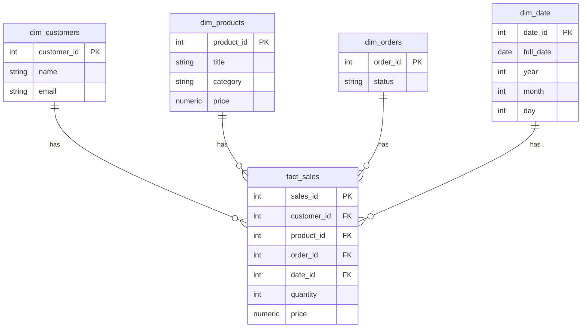

# E-Commerce Analytics Data Warehouse

This project is a small end-to-end data warehouse built on top of **Apache Airflow** (running with [Astro](https://www.astronomer.io/)), **Postgres**, and a few synthetic data sources.  
It’s meant as a learning/demo setup for running ETL pipelines, creating dimension/fact tables, and querying results in a BI tool like **DBeaver**.

---

## Project Overview

The pipeline moves data through three stages:

1. **Bootstrap Load (CSV)**

   - CSV files in `include/` (`customers.csv`, `products.csv`, `orders.csv`, `order_items.csv`)
   - Loaded into **staging tables** (`staging_customers`, `staging_products`, `staging_orders`, `staging_order_items`)

2. **API Ingestion**

   - Pulls product data from [FakeStore API](https://fakestoreapi.com/)
   - Inserts into `staging_products`
   - Simulates random orders → `staging_orders` & `staging_order_items`

3. **Transform to Warehouse**
   - Upserts from staging into **dimension tables**:  
     `dim_customers`, `dim_products`, `dim_orders`, `dim_date`
   - Builds the **fact table**: `fact_sales`

The result is a star schema you can query for sales analytics.

---

## Stack

- **Airflow** (managed by Astro CLI) – scheduling, orchestration
- **Postgres 15** – warehouse database
- **pandas** – used for CSV ingestion
- **DBeaver** – client for browsing and running queries

---

## Setup & Running

### 1. Clone the repo

```bash
git clone https://github.com/Caged1964/E-Commerce_Analytics_Data_Warehouse.git
cd E-Commerce_Analytics_Data_Warehouse
```

### 2. Start Postgres

```bash
docker-compose up -d
```

This brings up a `postgres` container and runs `postgres/schema.sql` to create all staging and warehouse tables.

### 3. Start Airflow with Astro

Make sure you have the [Astro CLI](https://docs.astronomer.io/astro/cli/overview) installed.

```bash
astro dev start
```

This will:

- Launch Airflow locally with the DAGs in `dags/`
- Mount the `include/` folder so bootstrap DAGs can access the CSVs
- Install dependencies from `requirements.txt`

### 4. Configure Postgres connection in Airflow

The DAGs expect a connection called `pg_connection`.

In the Airflow UI:

- Go to **Admin → Connections**
- Add new connection:

  - Conn Id: `pg_connection`
  - Conn Type: `Postgres`
  - Host: `postgres` (that’s the docker-compose service name)
  - Schema: `ecommerce_db`
  - Login: `postgres`
  - Password: `postgres`
  - Port: `5432`

  Note : These credentials are for local demo use only, If you ever deploy to production, use environment variables (not hard-coded values).

### 5. Trigger DAGs

In the Airflow UI you should see:

- `dag_bootstrap_load`
- `dag_fetch_api`
- `dag_transform_analytics` 

Run them in order the first time:

1. `dag_bootstrap_load`
2. `dag_fetch_api`
3. `dag_transform_analystics`

---

## Querying with DBeaver

1. Connect to Postgres:

   - Host: `localhost`
   - Port: `5432`
   - Database: `ecommerce_db`
   - User: `postgres`
   - Password: `postgres`

2. Example queries:

```sql
-- Check dimensions
SELECT * FROM dim_products LIMIT 10;
SELECT * FROM dim_customers LIMIT 10;

-- Fact table with sales totals
SELECT d.date, p.title, SUM(f.quantity * f.price) AS revenue
FROM fact_sales f
JOIN dim_products p ON f.product_id = p.product_id
JOIN dim_date d ON f.date_id = d.date_id
GROUP BY d.date, p.title
ORDER BY d.date DESC
LIMIT 20;
```

---

## Repo Structure

```
.
├── dags/                     # Airflow DAGs
│   ├── dag_bootstrap_load.py
│   ├── dag_fetch_api.py
│   └── dag_transform_analystics.py
├── include/                  # Sample CSVs for bootstrap
│   ├── customers.csv
│   ├── orders.csv
│   └── ...
├── postgres/
│   └── schema.sql            # Table definitions
├── tests/                    # DAG integrity tests
├── docker-compose.yml
├── Dockerfile
├── requirements.txt
└── README.md
```

---

## Notes

- The project is **not production-ready** — it’s a learning/demo setup.
- CSV ingestion uses row-by-row inserts for simplicity. For real data you’d want bulk loads (`COPY`).
- The `dag_fetch_api` DAG simulates orders randomly; it’s not real business data.
- Queries are best explored interactively in DBeaver or any SQL IDE.

---

---

## ER Diagram

Below is the star schema used in this project:


